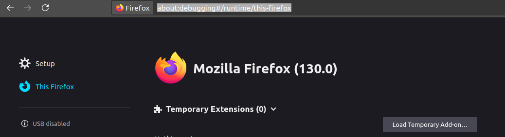
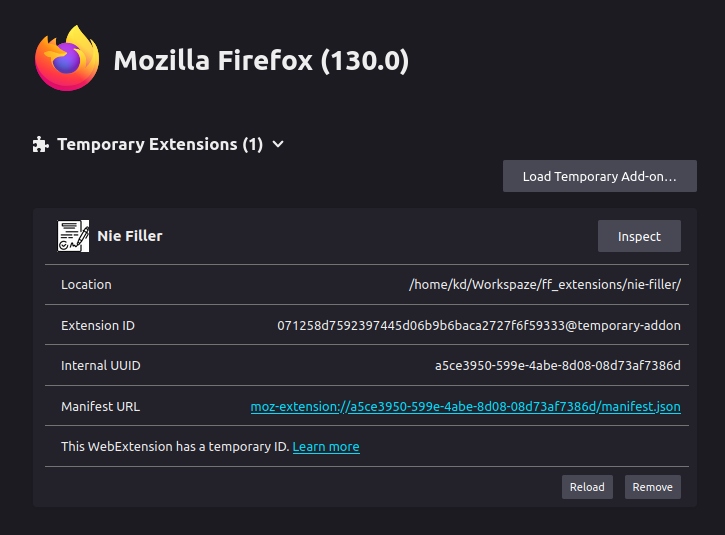
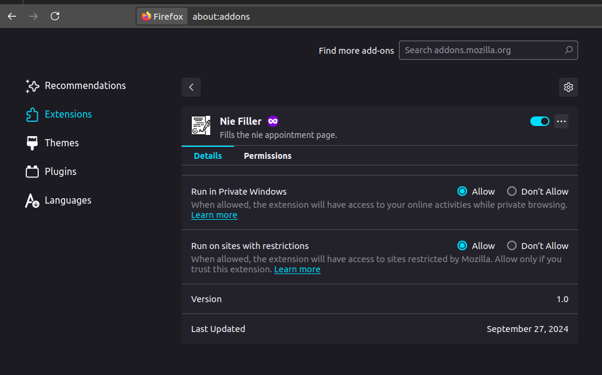

# Credits
Even though this fork has changed the original source a lot, it was inspired by and built upon [this repository](https://github.com/kirill-strizhak-zz/nie-filler) by [Kirill Strizhak](https://github.com/kirill-strizhak-zz). Thanks a lot for your work! ;)

# NIE Filler

This is a browser extension for NIE appointment request automation for EU citizens in Barcelona, Spain.

## Usage ##
1. Enter your personal information in *APPLICANT* in the [nie-filler.js](./nie-filler.js) file
2. Load this Extension as a temporary extension in your firefox-browser. (I have not tested this with other browsers. It might be functional, but would eventually need some adjustments as well (i.e. the notification part))

    i. open firefox and navigate to [about:debugging#/runtime/this-firefox](about:debugging#/runtime/this-firefox)
    

    ii. click on **Load Temporary Ad-on...**, navigate to the directory of these files and select any file (probably *nie-filler.js*, *background.js* or *manifest.json* should work just fine).
    The result should look something like this:
    

    iii. (optional) if you want to run this extension in a private browser (which worked best for me, as it was blocked fewer times from the website), go to [about:addons](about:addons), navigate to **Extensions** and give it the corresponding permissions
    

3. Navigate to https://icp.administracionelectronica.gob.es/icpplus/index.html and let the script do the boring stuff for you. (The green border shows you, that the extension is actually active)
4. Select appointment and enter captcha when prompted

## Tips ##
You might get blocked from the website from time to time.
You can try to adjust the delays between actions and the delay between retries, to stress the server a bit less.
Furthermore, once rejected it could help to just start a new (private) browser session and try again.
If none of the above helps, you just have to wait a few minutes before try again.

## Disclaimer ##
Be aware, that any change in the administrations website will most probably break this script.
Any efforts to keep this script actively maintained are very appreciated (as well as any efforts to completely redesign this registration process from the government!!).
